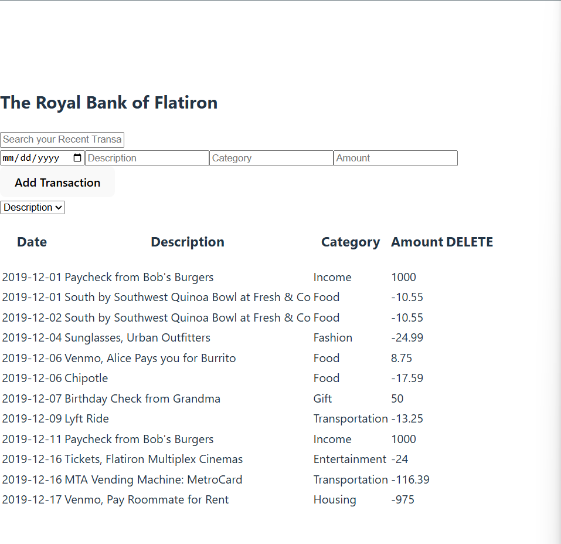
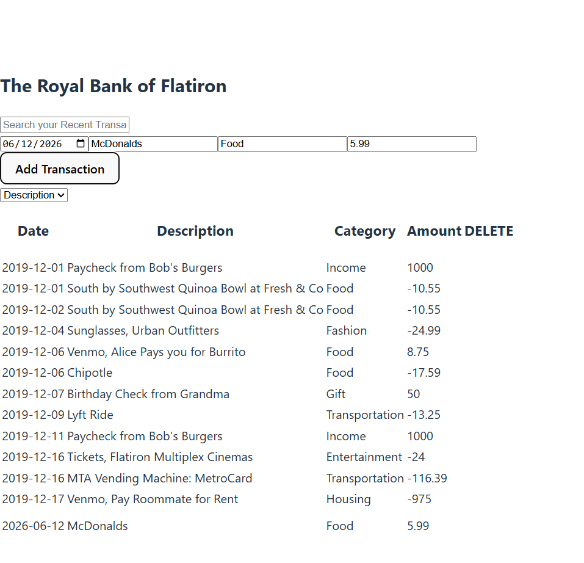
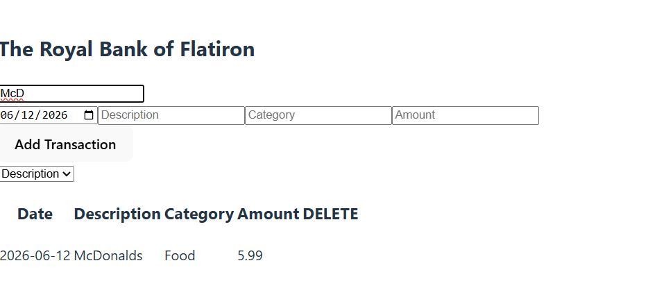
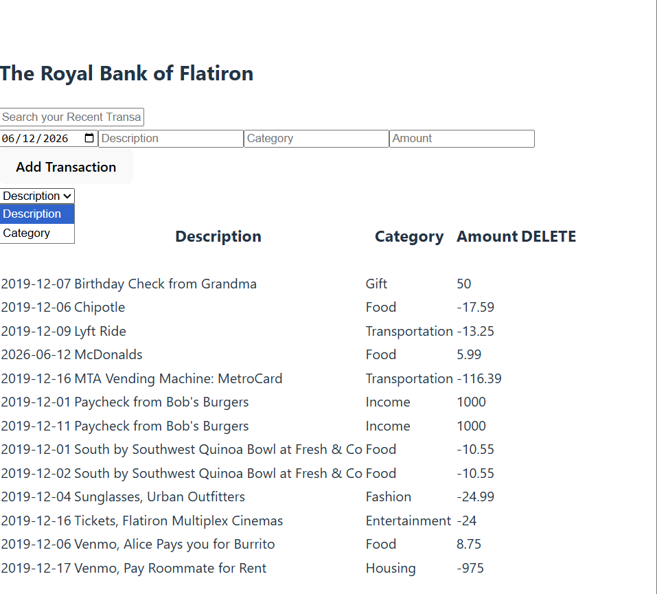
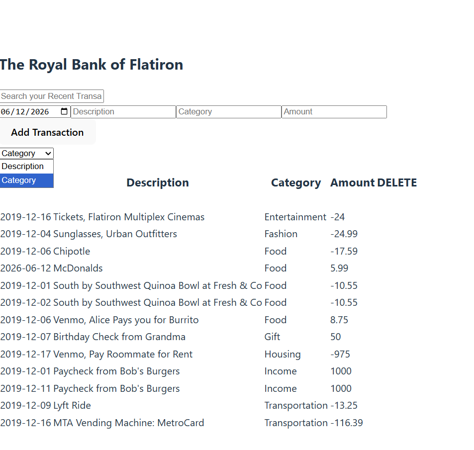
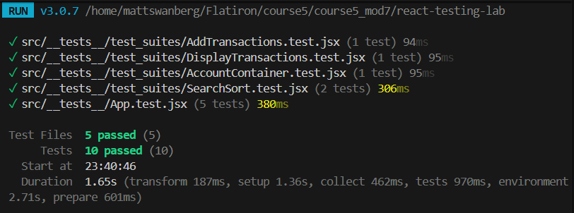

# Royal Bank of Flatiron

A React-based banking application that allows users to view, add, search, and sort financial transactions. This project was enhanced by implementing a comprehensive testing suite using Vitest and React Testing Library.

---

## Features

### View Transactions
- Loads transactions from the backend on application startup.
- Displays transaction date, description, category, and amount.

### Add Transactions
- Submit new transactions using the transaction form.
- Sends a POST request to the backend.
- Updates the UI immediately after a successful submission.

### Search Transactions
- Search transactions by description.
- Results update dynamically as the user types.

### Sort Transactions
- Sort transactions alphabetically by:
  - Description
  - Category

---

## Technologies Used

- React
- JavaScript
- Vitest
- React Testing Library
- JSON Server

---

## Installation

### Clone the Repository

```bash
git clone <your-repository-url>
cd <repository-name>
```

### Install Dependencies

```bash
npm install
```

---

## Running the Application

### Start the React App

```bash
npm run dev
```

### Start the Backend Server

```bash
npm run server
```

---

## Running Tests

Run all tests:

```bash
npm test
```

Or:

```bash
npx vitest run
```

---

## Test Coverage

The following functionality is covered by automated tests:

### Display Transactions
Verifies that transactions are displayed when the application loads.

### Add Transactions
Verifies that:

- New transactions appear in the UI.
- A POST request is sent to the backend.

### Search Transactions
Verifies that:

- Typing in the search field filters transactions appropriately.

### Sort Transactions
Verifies that:

- Transactions are sorted alphabetically by description.
- Transactions can be sorted by category.

---

## Screenshots

### Application Homepage



---

### Adding a Transaction



---

### Search Functionality



---

### Sort Functionality




### Test Suite Success



---

### Passing Test Suite


---

## Project Structure

```text
src
├── components
│   ├── AccountContainer.jsx
│   ├── AddTransactionForm.jsx
│   ├── Search.jsx
│   ├── Sort.jsx
│   ├── Transaction.jsx
│   └── TransactionsList.jsx
│
├── __tests__
│   ├── App.test.jsx
│   └── test_suites
│       ├── AddTransactions.test.jsx
│       ├── DisplayTransactions.test.jsx
│       └── SearchSort.test.jsx
```

## Author

Matthew Swanberg

Created as part of a React Testing with Vitest lab (course 5 mod 7).